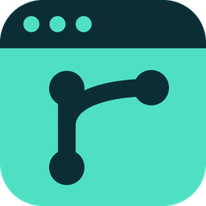
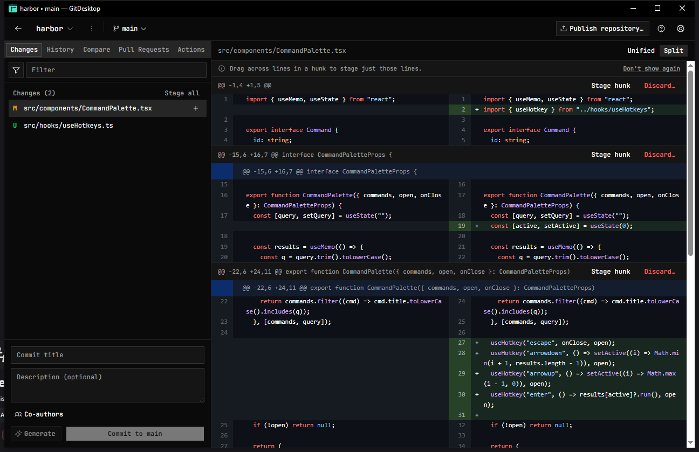
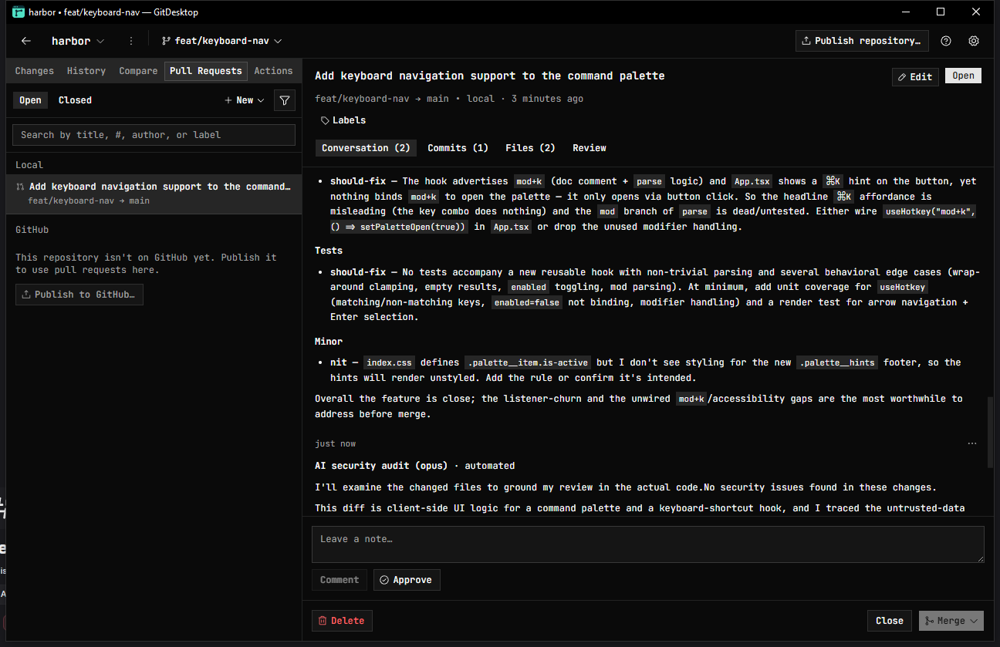
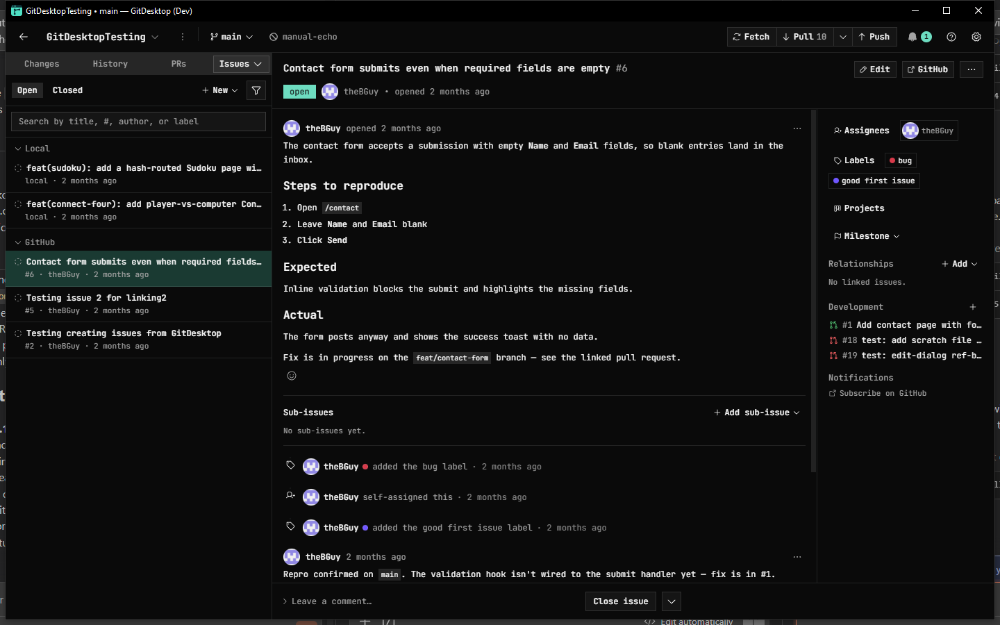
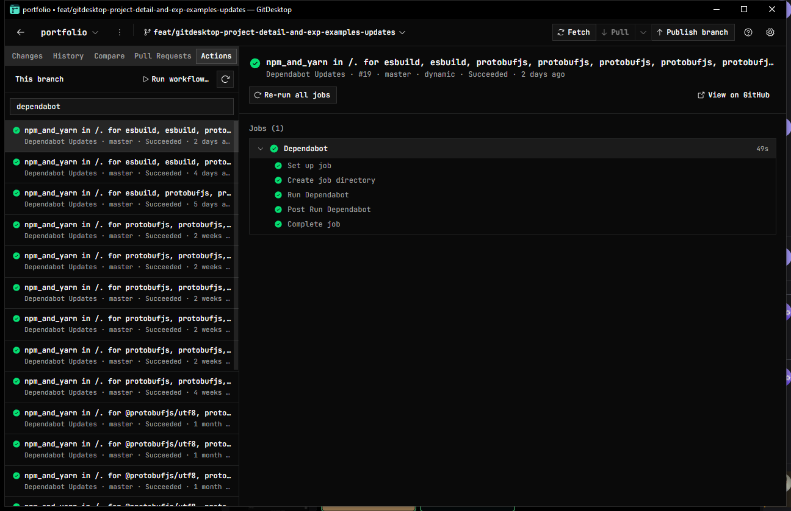

<p align="center">
  
</p>

<h1 align="center">GitDesktop</h1>

<p align="center"><strong>An AI-native, keyboard-first Git desktop client</strong></p>

<p align="center">
  <a href="https://github.com/theBGuy/GitDesktop/releases/latest"></a>
  <a href="LICENSE"></a>
  
</p>

GitDesktop keeps GitHub Desktop's approachable model and goes further: the full
pull-request lifecycle in the app (including offline "local" PRs), a GitHub
Actions cockpit, and AI woven through commits, reviews, and CI debugging — with
the provider you choose, local models included.

Built with **Tauri 2 + React 19**. All GitHub access goes through the **GitHub
CLI (`gh`)**: no OAuth app, and the app never stores your tokens. Core git runs
against any remote via system `git`.



## Install

**[Download the latest release →](https://github.com/theBGuy/GitDesktop/releases/latest)**
Pick the installer for your OS under **Assets**. Builds are signed and keep
themselves up to date (see [Updates](#updates)). Prefer to build from source? See
[Development](#development).

## Highlights

- **The whole PR lifecycle, in-app** — review, comment, label, approve, edit, and
  merge (merge/squash/rebase) GitHub PRs without the browser. Plus **local PRs**:
  the same workflow against any two branches with no remote, promotable to a real
  GitHub PR (comments and all) in one click.
- **Issues & Discussions, in-app** — triage GitHub issues (types, sub-issues,
  dependencies, linked PRs and branches) and Discussions without the browser, plus
  private **local to-dos** that need no remote.
- **GitHub Actions cockpit** — browse runs, drill into jobs and steps, re-run (all
  or failed), cancel, dispatch a workflow, and read failed-step logs — none of
  which GitHub Desktop does.
- **Delegate a task to an agent** — hand a coding task to an AI agent that works
  in an isolated worktree, so your own checkout is never touched. Watch its edits
  land live as it works, then review the diff and keep it as a branch — or open a
  local PR straight from it — or discard it. Run several at once, organized into
  **Active** and **Kept** tabs, searchable, with a notification when each finishes. Uses the CLI agent you already have —
  **Claude Code**, **Codex**, **GitHub Copilot**, or **opencode** (whose free
  hosted models need no key at all), no extra subscription. Sandbox its writes in a
  **Docker/Podman container**, or rely on each CLI's own worktree confinement on
  the host. Drive each turn with **slash commands and skills** — built-in
  starters, custom commands you define, and the selected agent's own commands and
  **Agent Skills** (project *and* global, including the shared `.agents/skills`) —
  plus `@file` mentions, a model/reasoning-effort picker, and terminal-style
  prompt history.
- **AI where it helps** — commit messages, branch names, PR and issue
  titles/descriptions, repository descriptions and topics, and a streaming code
  review or security audit. Bring your own provider: cloud APIs, local **Ollama**,
  or a **keyless CLI agent** you already pay for — the full list is under
  [AI configuration](#ai-configuration).
- **AI review that doesn't quit or repeat itself** — it keeps running while you
  move between PRs, and finishes in the tray even after you close the window.
  Re-runs remember the last round and fold in other reviewers' findings, so it
  builds on what's already been flagged instead of re-raising it.
- **Debug failed CI with AI** — turn a failed job's logs into a streamed
  root-cause + fix, ending with a ready-to-paste prompt for a coding agent.
- **Markdown everywhere you write** — Write/Preview tabs and a formatting toolbar
  (with Ctrl+B / I / K) on every comment, reply, and release-notes field, rendered
  to match GitHub's own styling: task lists, heading hierarchy, and
  syntax-highlighted code in ~190 languages (light and dark).
- **Privacy-first** — API keys live in the OS keychain (never in app files), local
  models keep code on your machine, AI-ignore patterns keep sensitive files out of
  context, and a single switch hides every AI surface.
- **Keyboard-first** — rebindable shortcuts with GitHub-Desktop-compatible
  defaults, a generated cheat sheet (Ctrl+/), a command palette (Ctrl+K), and
  arrow-key navigation everywhere.
- **Self-updating** — signed, verified auto-updates from GitHub Releases, always on
  your consent.

## Features

**Repositories** — clone, add local, create (README / .gitignore / license
scaffolding), publish to GitHub, and fork. A header repo switcher groups every
repo by owner with a Recent section and filter; aliases and recycle-bin-safe
removal. Star or unstar a repo from the menu, and (for admins) manage GitHub
repo settings — description and topics (with AI suggestions), merge options, and
webhooks with delivery history — without leaving the app. **Manage files** git
tracks or ignores beyond your pending changes: untrack a file committed by
mistake (kept on disk), or surface every ignored file with the rule responsible
and force-add it or remove that rule.

**Changes & commits** — unified/split diff with syntax highlighting,
collapsible surrounding context, and image diffing; filter the changes list by
path or category; the working-tree diff is one whole-file view with hunk- and
line-level staging and discarding (drag across the line numbers) — including
committing or discarding only part of a brand-new (untracked) file;
stage/unstage/discard single files or a multi-selection from the context menu;
discarding a whole untracked file goes to the recycle bin. Commit with title + body,
co-authors suggested from history, amend, undo, reset, and revert.

**Branches** — switch (bring-changes / stash prompt), create, rename, delete,
and **archive** (hide from the switcher without deleting). Per-branch ahead/behind
vs. the default branch and a PR badge in the switcher, update a branch *without*
checking it out, a Compare tab
(three-dot diff, commits ahead/behind, merge/rebase, jump to PR), and **local
branch-protection rules** (naming, merge methods, require-PR, force-push) that
are shareable via a committed file or importable from GitHub.

**History & advanced** — paged, filterable history with rich commit detail,
per-file history and line blame, and an at-a-glance marker on every commit that
hasn't been pushed yet; cherry-pick (onto the current or another branch),
squash and reorder unpushed commits behind an atomic replay engine, a stash
browser, tag management, and submodule management.

**Syncing** — fetch / pull / push with ahead/behind indicators; pull is
`--ff-only`, and divergence routes to a guarded force push with
`--force-with-lease`. In-progress merge/rebase/cherry-pick get a conflict banner
with gated Continue / Abort.

**Pull requests** — full read + write for GitHub PRs, plus **local PRs**: the full
PR workflow against any two branches with no remote at all. AI review + security
audit on any PR, with an activity indicator, a cancel, and a concurrency-capped
queue. Re-runs are iterative — they feed back the previous round and fold in other
bots' findings as soft, re-verifiable context (the current diff is always the
source of truth); per PR, ignore the prior review, trim a false finding, or opt out
of the external-bot folding. Write/Preview markdown editor (formatting toolbar and
live preview) everywhere you author.



**Issues & to-dos** — a dedicated tab for GitHub issues and private **local
to-dos** (no remote needed; publishable to GitHub in one click). Browse, create,
and edit (drafting with AI from your repo's issue templates), react with emoji,
and manage the full metadata: labels, assignees, milestones, issue type,
sub-issues, dependencies (blocked-by / blocking), and development links (linked
and closing PRs and branches, plus create-a-branch). Duplicate, transfer,
pin/unpin, lock/unlock, or delete.



**Discussions** — browse and read a repository's GitHub Discussions, create and
edit them, and react or upvote, with Write/Preview markdown throughout.

**GitHub Actions** — a dedicated tab with live run status, run detail, re-run /
cancel / manual dispatch, inline failed-step logs, **Debug with AI**, a current-branch
CI badge in the header, and run-completion notifications.



**Insights** — a repository-graphs tab (Ctrl/Cmd-9): commit activity, code
frequency (additions vs. deletions), contributor churn, and a commit punch card —
all computed **locally from your clone**, so they work offline, on private repos,
with no token or rate limit, and without GitHub's 10k-commit chart degradation.
Plus the at-a-glance overview (languages, contributors, sizes, branch-vs-default),
a GitHub Actions success-rate / duration trend, a community-health card,
14-day **traffic** (views/clones/referrers/paths, with push access), a
**dependencies** card, and quick links to the web-only GitHub insights (Pulse,
network, dependents, Actions metrics, stars over time). Charts ship one-line
captions, data-table fallbacks, and keyboard navigation.

**Git hooks** — view, edit, enable/disable, and template `.git/hooks`, with
husky / pre-commit / lefthook detection and install integration.

**Automations** — rules like "on PR open → run AI review + security audit," with
global defaults and per-repo overrides.

**Integrations** — open in any editor or terminal (auto-detected, or point at any
executable), and tunable OS notifications for PR activity, checks, and CI runs.

**Environment check** — a Settings → **About** panel reports your app/OS/Tauri
versions and the status of every CLI GitDesktop uses (git, the GitHub & GitLab
CLIs, Claude Code, Codex): installed?, version, resolved path, and sign-in
state — with an Install link for anything that's missing. It also shows a live
readout of the window's current position, size, and display (with copy-coords).

**Window memory** — GitDesktop reopens at the size and position you left it, and
maximized if it was, validated against your current monitors so an unplugged
display can't strand it off-screen.

## AI configuration

- **Providers** — Anthropic, OpenAI, OpenRouter, local **Ollama**, **Ollama
  Cloud** (hosted models via an API key), and the **Claude Code / Codex / GitHub
  Copilot / opencode CLIs** (keyless, via your subscription — or opencode's free
  hosted models). Separate models for generation vs. review;
  live model lists in a searchable picker.
- **Custom instructions** (included in every generation):
  - **Global** — Settings → AI instructions (e.g. "Follow Conventional Commits").
  - **Per-repo** — `.gitdesktop/instructions.md` in the repo. Takes precedence.
- **AI ignore patterns** (keep files out of AI context; they still commit
  normally), gitignore-style:
  - **Global** — Settings → Excluded files (one pattern per line).
  - **Per-repo** — `.gitdesktop/aiignore` in the repo.
- **Keys** live in the OS keychain (Windows Credential Manager, macOS Keychain,
  libsecret). **Hide AI** (Settings → General) hides every AI surface while
  keeping your config.

## Updates

GitDesktop checks GitHub Releases on launch (opt-out in Settings → Updates) and
installs **only on your consent**. Updates are cryptographically signed and
verified by the app — separate from OS code signing. Maintainer release steps:
[docs/deployment-updates.md](docs/deployment-updates.md).

## Requirements

- **git** on `PATH` (required).
- **GitHub CLI (`gh`)**, installed and authenticated (`gh auth login`), for the
  pull-request and Actions features — they stay hidden when it isn't available.
- An **AI provider** for the AI features: an API key (Anthropic / OpenAI /
  OpenRouter / **Ollama Cloud**), a local **Ollama** server, or a signed-in
  **Claude Code / Codex** CLI. All optional.

## Development

Prereqs: Rust toolchain, Node 20+, pnpm.

```sh
pnpm install
pnpm tauri dev    # run the app
pnpm build        # typecheck + bundle the frontend
pnpm lint         # biome
cargo test --manifest-path src-tauri/Cargo.toml   # Rust unit tests
```

### Architecture

- `src-tauri/src/git/` — typed Tauri commands that shell out to system `git`
  (porcelain v2 parsing, per-repo mutation locks, timeouts).
- `src-tauri/src/github/` — `gh`-backed commands: pull requests (`pr.rs`) and
  GitHub Actions (`actions.rs`).
- `src-tauri/src/{hooks,secrets,instructions}.rs` — git-hook management, OS
  keychain storage, and repo instruction/rule files.
- `src-tauri/src/agent.rs` — drives local coding-agent CLIs (Claude Code / Codex /
  GitHub Copilot / opencode) for keyless AI review, sessions, and CI debugging.
- `src/lib/` — invoke bindings + TanStack Query hooks (`git/`, `github/`),
  the AI layer (`ai/`, Vercel AI SDK over the Tauri HTTP plugin so requests
  bypass webview CORS), settings, and the hotkey registry.
- `src/features/` — the screens: repository, changes/diff, commit, history,
  compare, pulls, actions, hooks, branch-rules, settings, and updates.

## Contributing

Contributions are welcome! See [CONTRIBUTING.md](CONTRIBUTING.md) for setup, the
conventions we follow (Conventional Commits, Biome, a `[Unreleased]` changelog
entry), and how to open a good PR. Please also read the
[Code of Conduct](CODE_OF_CONDUCT.md). For questions, see
[SUPPORT.md](.github/SUPPORT.md); to report a vulnerability, follow
[SECURITY.md](SECURITY.md).

## Sponsor

GitDesktop is free and open source under Apache 2.0. If it earns a place in your
daily workflow, you can support continued development:

- **[GitHub Sponsors](https://github.com/sponsors/theBGuy)**
- **[Buy Me a Coffee](https://buymeacoffee.com/theBGuy)**

## Privacy

GitDesktop never collects your code, file contents, or repository details.
Optional anonymous usage analytics can be turned off in Settings → General, and
masked session replay stays off until you opt in. Full details:
[PRIVACY.md](PRIVACY.md).

## License

Licensed under the [Apache License 2.0](LICENSE).
